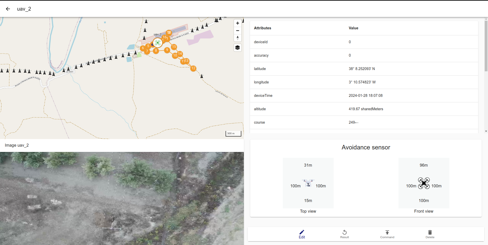

# MUAV GUI Documentation

> A GCS software that allow command and monitoring multiple UAVs for a heterogeneous fleet of unmannned Aerial Vehicles (UAVs).

This project is part of [Multi UAV System Project](https://github.com/alvcaballero/multiUAV_system)

## What it is

## 📋 Features

- [x] **Multi-robot**: Allow monitoring and control multiple robot at same time or individual.

- [x] **Heterogeneity**: Each vehicle can possess distinct capabilities, including various velocities and battery requirements (maximum time of flight).

- [x] **Multi-User**: Interact with the web application to monitoring and control de robot fleet or a single robot can be access athrough internet or in local network.

- [x] **Third-party sotfware**: Interact with other software thought API like abstraction layer for big proyects.

- [x] **ROS easy integration**: Easy integration with diferents robot using ROS

- [x] **Mission Planning**: Allow create waypoint mission in the web interface and export in diferets formats.

- [x] **Mission Planning**: Allow create waypoint mission in the web interface and export in diferets formats.

- [x] **Video Straming from robot**: Actually allow integration to mavlink through ros packages mavros, in future use directly mavlink.

- [ ] **Mavlink integration**: Actually allow integration to mavlink through ros packages mavros, in future use directly mavlink.

## Devices compatible

This GCS is compatible with any ros devices with few modifications. with any modification is complatible with DJI and MAVROS Devices.

