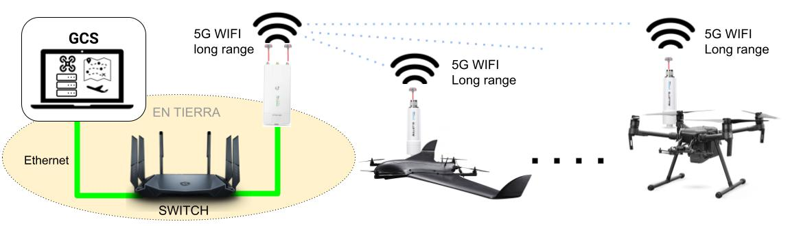

# Hardware Necesario

A nivel de hardware los UAV se comunican directamente con la GCS a través WIFI long range utilizando el estándar WiFi 802.11 a/b/g/n/ac a una frecuencia operativa de 5 GHz. Para ello, se utilizaron dispositivos Ubiquiti Bullet AC que se encuentran alimentadas 12 V, conectadas al computador abordo con un inyector de POE.

Cada ubiquiti tiene conectada una antena omnidireccional **Fatshark**
